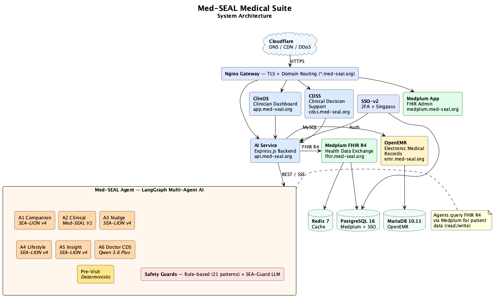

<p align="center">
  
  
  
  
  
</p>

# Med-SEAL Medical Suite

**Enterprise Healthcare Platform for Singapore** — Clinical Systems, AI-Powered Decision Support & Interoperable Health Data Exchange

Med-SEAL Medical Suite is a production-grade healthcare platform integrating electronic medical records, FHIR R4 interoperability, multi-agent AI decision support, and single sign-on authentication. Designed and built for Singapore's healthcare ecosystem in compliance with SGDS, DSS, and WCAG 2.1 AA standards.

> A collaboration between the **National University of Singapore (NUS)**, **Synapxe** (Singapore's national HealthTech agency), and **IMDA** (Infocomm Media Development Authority).

---

## Table of Contents

- [Architecture](#architecture)
- [System Components](#system-components)
- [Med-SEAL Agent (Multi-Agent AI)](#med-seal-agent-multi-agent-ai)
- [Tech Stack](#tech-stack)
- [Prerequisites](#prerequisites)
- [Quick Start](#quick-start)
- [Environment Configuration](#environment-configuration)
- [Service Endpoints](#service-endpoints)
- [API Reference](#api-reference)
- [Deployment](#deployment)
- [Standards Compliance](#standards-compliance)
- [Repository Structure](#repository-structure)
- [Related Repositories](#related-repositories)
- [Security](#security)
- [Contributing](#contributing)
- [License](#license)

---

## Architecture

<p align="center">
  
</p>

<details>
<summary>PlantUML source</summary>

See [`docs/architecture.puml`](docs/architecture.puml) to regenerate:

```bash
plantuml -tpng -o . docs/architecture.puml
```

</details>

---

## System Components

### Core Clinical Systems

| Component | Domain | Description |
|-----------|--------|-------------|
| **OpenEMR** | `emr.med-seal.org` | Electronic Medical Records — patient demographics, encounters, prescriptions, clinical notes |
| **Medplum FHIR R4** | `fhir.med-seal.org` | HL7 FHIR R4 server — interoperable health data exchange, patient resources, observations |

### AI & Clinical Decision Support

| Component | Domain | Description |
|-----------|--------|-------------|
| **Med-SEAL Agent** | External service | Multi-agent AI system — 7 specialized agents for patient and clinician support |
| **AI Service** | `api.med-seal.org` | Express.js backend — clinical chat, CDS alerts, ambient summaries |
| **CDSS** | `cdss.med-seal.org` | Clinical Decision Support System — real-time clinical alerts and recommendations |
| **AI Frontend (ClinOS)** | `app.med-seal.org` | Clinician dashboard — React + Carbon Design System (IBM) |

### Authentication & Identity

| Component | Description |
|-----------|-------------|
| **SSO-v2** | Single Sign-On frontend (Vite + React + Carbon Design) — unified login across all services |
| **Auth Module** | 2FA (TOTP), SSO auto-login, bcrypt password management, Singpass integration |

### Infrastructure

| Component | Description |
|-----------|-------------|
| **Nginx Gateway** | Reverse proxy — TLS termination, domain routing, CORS, SSE pass-through |
| **Docker Compose** | Full stack orchestration — 10+ containers with health checks and dependencies |
| **Data Sync** | Bi-directional synchronization between OpenEMR, Medplum FHIR, and SSO databases |
| **Huawei Cloud CCE** | Production deployment on Kubernetes (Cloud Container Engine, ap-southeast-1) |

---

## Med-SEAL Agent (Multi-Agent AI)

A multi-agent AI system built with LangGraph, powered by SEA-LION v4-32B (IMDA), Med-SEAL V1, and Qwen 3.6 Plus, designed for 24/7 patient support and clinician decision assistance.

### Agent Architecture

| Agent | Role | Model | Description |
|-------|------|-------|-------------|
| **A1 — Companion** | Patient Hub | SEA-LION v4-32B | Conversational interface, intent routing, multi-language (EN/ZH/MS/TA) |
| **A2 — Clinical Reasoning** | Medical Q&A | Med-SEAL V1 | Evidence-based clinical answers from EHR data |
| **A3 — Nudge** | Reminders | SEA-LION v4-32B | Medication adherence alerts, appointment nudges |
| **A4 — Lifestyle** | Wellness | SEA-LION v4-32B | Culturally-appropriate dietary coaching (Halal, Chinese, Indian) |
| **A5 — Insight Synthesis** | Summaries | SEA-LION v4-32B | Pre-visit summaries aggregated from FHIR data |
| **A6 — Doctor CDS** | Clinician | Qwen 3.6 Plus | Clinical decision support for healthcare providers |
| **Pre-Visit Summary** | Aggregation | None (FHIR only) | Pure FHIR data aggregation — no LLM, deterministic |

### Safety Guards

```
Input  →  Rule-Based Guard (21 regex patterns: injection, PII, toxicity)
       →  SEA-Guard LLM (novel threat detection)
       →  Agent Processing
Output →  Content filtering
       →  Surface-aware restrictions (clinician: unrestricted, patient: protected)
```

See [`Med-SEAL-Agent/`](Med-SEAL-Agent/) for full agent specifications, API documentation, and integration guides.

---

## Tech Stack

| Layer | Technologies |
|-------|--------------|
| **Backend** | Express.js, Node.js 20 LTS, FastAPI, Python 3.11+ |
| **Frontend** | React 18, Vite 5, Carbon Design System (IBM), SCSS |
| **Database** | PostgreSQL 16, MariaDB 10.11, Redis 7 |
| **FHIR** | Medplum R4 Server v5.1.6 |
| **AI/LLM** | SEA-LION v4-32B (IMDA), Med-SEAL V1, Qwen 3.6 Plus, Google Gemini 2.5 Flash |
| **Orchestration** | Docker Compose, Nginx, LangGraph, LangFuse (observability) |
| **Authentication** | 2FA (TOTP), SSO, Bcrypt, Singpass (Singapore National Digital Identity) |
| **Cloud** | Huawei Cloud CCE (Kubernetes), Cloudflare DNS/CDN |
| **Standards** | HL7 FHIR R4, SGDS, WCAG 2.1 AA, DSS, USCDI v3 |

---

## Prerequisites

- **Docker** 24+ and **Docker Compose** v2
- **Node.js** 20 LTS (for scripts and local development)
- **Git** 2.30+
- 8 GB RAM minimum (16 GB recommended for full stack)

---

## Quick Start

```bash
# 1. Clone the repository
git clone https://github.com/IgoyAI/Med-SEAL-Medical-Suite.git
cd Med-SEAL-Medical-Suite

# 2. Configure environment
cp .env.example .env
# Edit .env with your database passwords and API keys

# 3. Generate TLS certificates (development)
mkdir -p gateway/certs
openssl req -x509 -nodes -days 365 -newkey rsa:2048 \
  -keyout gateway/certs/privkey.pem \
  -out gateway/certs/fullchain.pem \
  -subj "/CN=*.med-seal.org"

# 4. Start all services
docker compose up -d

# 5. Verify health
docker compose ps
curl -f http://localhost:4003/health   # AI Service
curl -f http://localhost:8081          # OpenEMR
```

### Seed Demo Data

```bash
# Load Synthea patients into Medplum FHIR
node scripts/load-synthea.js

# Sync FHIR data to OpenEMR
node scripts/sync-medplum-openemr.js

# Sync clinical data (conditions, medications, allergies)
node scripts/sync-fhir-clinical.js
```

---

## Environment Configuration

Copy `.env.example` to `.env` and configure:

| Variable | Description | Required |
|----------|-------------|----------|
| `LLM_API_KEY` | API key for LLM provider (OpenRouter / Azure) | Yes |
| `MEDPLUM_DB_PASSWORD` | PostgreSQL password for Medplum FHIR server | Yes |
| `OPENEMR_DB_ROOT_PASSWORD` | MariaDB root password for OpenEMR | Yes |
| `OPENEMR_DB_PASSWORD` | MariaDB user password for OpenEMR | Yes |
| `OPENEMR_ADMIN_PASSWORD` | OpenEMR admin UI password | Yes |
| `SSO_DB_PASSWORD` | PostgreSQL password for SSO database | Yes |
All passwords default to `changeme` if not set. **Change these before any non-local deployment.**

---

## Service Endpoints

### Local Development

| Service | URL | Port |
|---------|-----|------|
| AI Frontend (ClinOS) | http://localhost:3001 | 3001 |
| AI Service API | http://localhost:4003 | 4003 |
| CDSS | http://localhost:3002 | 3002 |
| OpenEMR | http://localhost:8081 | 8081 |
| Medplum FHIR R4 | http://localhost:8103 | 8103 |
| Medplum App | http://localhost:3000 | 3000 |

### Production (med-seal.org)

| Service | URL |
|---------|-----|
| ClinOS Dashboard | https://app.med-seal.org |
| AI Service API | https://api.med-seal.org |
| CDSS | https://cdss.med-seal.org |
| OpenEMR | https://emr.med-seal.org |
| FHIR R4 | https://fhir.med-seal.org/fhir/R4 |
| Medplum App | https://medplum.med-seal.org |

---

## API Reference

### AI Service (`api.med-seal.org`)

| Method | Endpoint | Description |
|--------|----------|-------------|
| `GET` | `/health` | Health check |
| `POST` | `/api/login` | SSO authentication |
| `POST` | `/api/chat` | Clinical chat (LLM-powered) |
| `GET` | `/api/chat/stream` | SSE streaming chat |
| `GET` | `/api/patients` | Patient list (from FHIR) |
| `GET` | `/api/patients/:id` | Patient details |
| `POST` | `/api/cds/alerts` | Clinical Decision Support alerts |
| `POST` | `/api/ambient/summary` | Ambient clinical summary |
| `GET` | `/api/audit` | Audit log retrieval |
| `POST` | `/api/users` | User management |

### Med-SEAL Agent

| Method | Endpoint | Description |
|--------|----------|-------------|
| `POST` | `/sessions` | Create chat session |
| `POST` | `/sessions/{id}/messages` | Send message (sync) |
| `POST` | `/sessions/{id}/messages/stream` | Send message (SSE stream) |
| `GET` | `/sessions/{id}` | Session details |
| `GET` | `/health` | Agent health check |

See [`Med-SEAL-Agent/AGENT_API.md`](Med-SEAL-Agent/AGENT_API.md) for full request/response schemas and integration examples.

---

## Deployment

### Docker Compose (Development / Staging)

```bash
docker compose up -d          # Start all services
docker compose ps             # Check status
docker compose logs -f ai-service  # Follow logs
docker compose down           # Stop all
```

### Huawei Cloud CCE (Production)

Production deployment uses Kubernetes on Huawei Cloud Container Engine in the `ap-southeast-1` (Singapore) region.

```bash
cd huawei/

# 1. Provision infrastructure (VPC, ECS, CCE cluster)
bash setup.sh

# 2. Create managed databases (RDS MySQL, PostgreSQL, DCS Redis)
bash databases.sh

# 3. Create Kubernetes secrets
bash secrets.sh

# 4. Build and push container images
bash push-images.sh

# 5. Deploy workloads
kubectl apply -f k8s/

# 6. Configure ELB and DNS
bash setup.sh   # Follow ELB + domain steps
```

See [`huawei/README.md`](huawei/README.md) for detailed cloud deployment instructions.

---

## Standards Compliance

| Standard | Scope | Status |
|----------|-------|--------|
| **HL7 FHIR R4** | Healthcare data interoperability | Implemented (Medplum R4 Server) |
| **SGDS** | Singapore Government Design System | Compliant (typography, spacing, components) |
| **WCAG 2.1 AA** | Web accessibility | Compliant (contrast, keyboard nav, screen reader) |
| **DSS** | Digital Service Standards (Singapore) | Compliant |
| **USCDI v3** | US Core Data for Interoperability | Supported |
| **ICD-10** | Clinical coding | Supported via OpenEMR |

---

## Repository Structure

```
Med-SEAL-Medical-Suite/
├── apps/
│   ├── ai-frontend/         # ClinOS clinician dashboard (React + Carbon)
│   ├── ai-service/          # Backend API (Express.js + Node.js)
│   ├── cdss/                # Clinical Decision Support (React)
│   └── openemr/             # OpenEMR custom modules
├── Med-SEAL-Agent/          # Multi-agent AI system (LangGraph + Python)
│   ├── agent/               # Agent implementations
│   ├── configs/             # Agent configurations
│   ├── eval/                # Evaluation framework
│   ├── langfuse/            # Observability (LangFuse)
│   └── tests/               # Test suite
├── sso-v2/                  # Single Sign-On (Vite + React + Carbon)
├── gateway/                 # Nginx reverse proxy + TLS
├── medplum/                 # Medplum FHIR server configuration
├── openemr/                 # OpenEMR configuration + custom assets
├── huawei/                  # Huawei Cloud CCE deployment scripts
│   └── k8s/                 # Kubernetes manifests
├── scripts/                 # Data seeding, FHIR sync, utilities
├── docker-compose.yml       # Full stack orchestration (13+ services)
├── .env.example             # Environment variable template
├── CHANGELOG.md             # Release history
├── SECURITY.md              # Security policy
├── CONTRIBUTING.md          # Contribution guidelines
└── LICENSE                  # License terms
```

---

## Related Repositories

| Repository | Description |
|-----------|-------------|
| [Med-SEAL-Suite](https://github.com/IgoyAI/Med-SEAL-Suite) | Full monorepo including mobile patient portals (React Native + SwiftUI) |
| [Med-SEAL-docs](https://github.com/IgoyAI/Med-SEAL-docs) | Documentation site ([igoyai.github.io/Med-SEAL-docs](https://igoyai.github.io/Med-SEAL-docs)) |

---

## Security

See [SECURITY.md](SECURITY.md) for our security policy, vulnerability reporting process, and architecture security overview.

**Key security measures:**
- TLS encryption on all external endpoints
- 2FA (TOTP) + Singpass authentication
- Bcrypt password hashing
- Role-based access control (RBAC)
- Dual-layer AI safety guards (rule-based + LLM)
- No secrets in source code (environment variable injection)
- Audit logging for all clinical data access

---

## Contributing

See [CONTRIBUTING.md](CONTRIBUTING.md) for development guidelines, code style, and pull request process.

---

## License

This software is proprietary and developed as part of the **Med-SEAL research initiative** by the National University of Singapore (NUS), Synapxe, and IMDA. All rights reserved.

See [LICENSE](LICENSE) for full terms.
